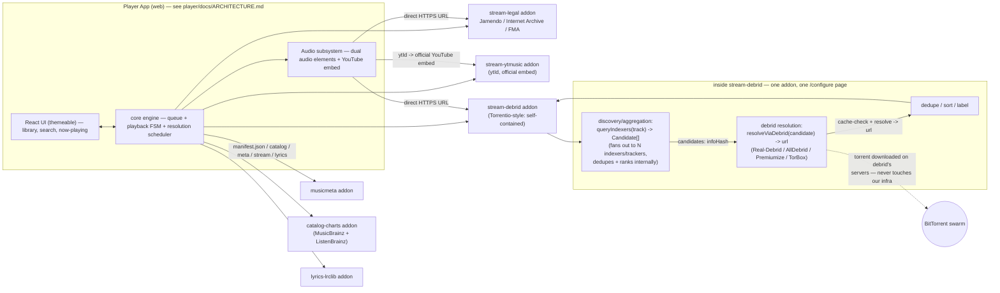

# P2P Songs — Implementation Plan

A Stremio-style system for music: a thin **player**, a stateless **addon
protocol** (HTTP+JSON) that anyone can implement, and one self-contained
**debrid-backed stream addon** — the same shape as
[Torrentio](https://github.com/TheBeastLT/torrentio-scraper): discovery
(query indexers/trackers), aggregation (combine and rank those results),
and debrid resolution (turn a chosen result into a direct link) all live
inside that one addon, using debrid services "as it sees fit." Everything
resolves server-side into a direct, Range-servable HTTPS link before the
player ever asks for it. A **discovery/metadata layer** is informed by
[Spotube](https://github.com/krtirtho/spotube)'s metadata-source/audio-source
split, though Spotube itself has no addon protocol or debrid layer (§4).
The player and core never speak BitTorrent — that's the whole point.

> **Precedence rule (read first).** The project is split across **five GitHub
> repos** — `.github` (this doc + cross-repo docs), `player`, `addon-sdk`,
> `addons`, and `backend` (optional self-hosted accounts/sync, added later) —
> not the single monorepo an early draft of this doc sketched. For anything
> about the **player / core engine**, the authoritative
> source is [`player/docs/ARCHITECTURE.md`](https://github.com/p2p-songs/player/blob/main/docs/ARCHITECTURE.md);
> where this plan and that document differ about the player, that document
> wins. This plan remains authoritative for the **protocol, addons,
> `stream-debrid`, and the legal model.** Repo layout is §9; per-repo build
> order lives in each repo (the player's is ARCHITECTURE.md §10).

---

## 1. How Stremio Actually Works (the part we're copying)

Stremio is three loosely-coupled things that only agree on a wire protocol:

| Layer | Repo | Job |
|---|---|---|
| **Addons** | any HTTP server (SDK: [`stremio-addon-sdk`](https://github.com/Stremio/stremio-addon-sdk)) | Answer `manifest.json`, `/catalog`, `/meta`, `/stream`, `/subtitles` requests with JSON. Stateless, no auth, CORS-open. |
| **Core** | [`stremio-core`](https://github.com/Stremio/stremio-core) (Rust) | The "brain": addon collection, library, search aggregation, player state, settings. `Msg` in, `Effects` out, `Model` updated. Compiled once, reused everywhere. |
| **Player** | closed-source app shell / `stremio-core-web` for the web bridge | Just a `<video>`/MPV element pointed at whatever URL a stream addon returned. |

**Addons never handle media themselves — they hand back a pointer.** That
pointer can be a torrent `infoHash`/`fileIdx`, or it can already be a plain
`url` if the addon resolved it server-side. That second path, taken all the
way, is what Torrentio does — and what we're building.

---

## 2. How `stream-debrid` Works: the Torrentio Pattern

> **Naming (2026-07-21).** The debrid stream addon is called **Bitbop**
> (`@p2p-songs/bitbop`, manifest id `com.p2p-songs.bitbop`, display name
> "Bitbop"). **`stream-debrid` remains the role name** used throughout this plan
> and the review checklist — where those docs say `stream-debrid`, the
> implementation is Bitbop. Same addon; the name is the product, the term is the
> architecture. **Implemented 2026-07-21** — see the `addons` repo,
> `packages/bitbop`.

[Torrentio](https://github.com/TheBeastLT/torrentio-scraper) is one
self-contained Stremio addon, not a layer sitting on top of other addons.
On a `/stream` request it:

1. **Discovers** — queries the trackers/indexers it's built to query, for
   candidates matching the requested title.
2. **Aggregates** — combines and ranks those results into one list, inside
   the same addon (no separate meta-aggregator, no fanning out to *other*
   installed addons).
3. **Resolves via debrid, as it sees fit** — if the user pasted a
   Real-Debrid/AllDebrid/etc. key into Torrentio's **own** `/configure`
   page, Torrentio calls that provider's API itself and hands back a direct
   link instead of a torrent pointer. No debrid key configured → it falls
   back to returning a raw `infoHash` for Stremio's local torrent engine.

**`stream-debrid` is that same shape, one to one:** one addon, its own
`/configure` page, its own discovery logic, its own debrid client — no
`StreamProvider` plugin interface for aggregating other addons, no
AIOStreams-style meta-layer. (An earlier draft of this plan added that
plugin interface, reaching for the AIOStreams shape; it's removed.
AIOStreams is a different, separate pattern — set aside for now, per your
call.) Internally that's still two clean, testable modules, just not
exposed as a network-callable boundary:

- **Discovery/aggregation:** `queryIndexers(request) -> Candidate[]` — fans
  out to whatever Jackett/Prowlarr-style indexers are configured, de-dupes
  and ranks the combined results.
- **File selection (music-specific — the step Torrentio doesn't need):**
  `pickFile(candidate, request) -> fileIdx`. See below.
- **Resolution:** `resolveViaDebrid(candidate, fileIdx) -> url` — cache-checks
  and calls the configured debrid provider's API for **that specific file**,
  "as it sees fit": cached → resolve immediately; nothing cached → either skip
  it or (if you choose to support it) trigger a download on the debrid side and
  poll.

`discover -> pick file -> resolve -> dedupe/sort/label -> respond`, all inside
one addon, one `/configure` page, one deployment.

### 2a. Resolving a **recording** to a file in an **album** torrent

This is where the entity-typed ID scheme (§8) becomes operationally
load-bearing, and where music diverges from video. A movie torrent is
effectively one file, so Torrentio just takes the largest file. A **music
torrent is a whole album (release)** — one `infoHash` with many track files
across one or more discs — so "largest file" is meaningless (all tracks are
similar size). `stream-debrid` must pick the *right track file*.

The `/stream` request carries **`mbid:recording:<uuid>`** ("what song") plus,
when the player has it, the album-context **`mbid:track:<uuid>` /
`mbid:release:<uuid>`** ("which pressing, which disc+position"). `stream-debrid`
uses them like this:

1. **Target a release.** With album context, aim discovery at torrents for that
   release; without it (e.g. a radio pick from a bare recording), choose a
   canonical release the recording appears on (via MusicBrainz) and target that.
2. **Match the file.** Given the album torrent's file list, select the file for
   the track: **by disc + track position when album context is present**
   (deterministic — this is why `mbid:track:` matters), else by fuzzy
   title + duration match against the recording's metadata.
3. **Resolve that file.** Hand the chosen `fileIdx` to the debrid client;
   cache-check and unrestrict → a direct URL to *that one track file*. The
   player still only ever receives a fully-resolved `url` (never an `infoHash`/
   `fileIdx`), consistent with §8 — the file selection is entirely internal.

So: yes, the recording-as-streamable-unit model works with the debrid addon —
in fact the recording/track split is what lets `stream-debrid` deterministically
pick the correct file inside a multi-track album torrent instead of guessing.
Passing album context whenever the player has it is what keeps step 2
deterministic; the fuzzy fallback covers the context-free case.

---

## 3. Legal Compliance Model — Staying in Stremio's Posture

Stremio's legal position rests on a layering that's worth reproducing
exactly, not just gesturing at:

| Layer | Who operates it | Posture |
|---|---|---|
| Protocol + SDK + core + player | Stremio the company | Neutral infrastructure. Bundles only Cinemeta (metadata, no streams). Never hosts, indexes, or endorses a content source. This is why Stremio-the-app is legally comparable to a browser. |
| Torrentio (and similar community stream addons) | Independent, often anonymous third parties — and, notably, **publicly hosted** for anyone to use (torrentio.strem.fun), not just self-hosted | Not affiliated with or endorsed by Stremio; each is its own legal actor. It never stores or caches copyrighted files on its own infrastructure — it returns pointers (magnet hashes, or a debrid link resolved with **the requesting user's own** debrid API key). Public hosting is viable specifically because those two things hold. |

Applying this exactly to our project:

- **The `addon-sdk` and `player` repos stay fully neutral.** They ship with
  zero bundled stream sources beyond what a user installs by pasting a manifest
  URL. This is the layer that needs to be as clean as Stremio-the-app — don't
  let it default-install `stream-debrid`. (Note: the player *does* end up
  holding the user's debrid key inside a configured addon URL — see
  ARCHITECTURE §6a — but that's the user's own credential handled as a secret,
  not a bundled source.)
- **`stream-debrid` can be hosted the same way Torrentio is — publicly, if
  you want — as long as the same two invariants hold:** it never stores or
  caches audio files on its own infrastructure (it only ever holds
  candidate metadata: title, hash, size), and every debrid API call uses
  **the requesting user's own** debrid credentials from their `/configure`
  config, never a shared/pooled account it pays for itself. Those two
  invariants, not "must stay self-hosted," are what keep it in Torrentio's
  posture rather than becoming something riskier.
- **The indexer and the debrid account are the user's own.** `stream-debrid`
  can ship built-in discovery logic (Torrentio does too — it doesn't make
  users bring their own indexer), but the debrid subscription is always the
  end user's, entered per-request via config, never baked into the addon.
- **One caveat worth flagging plainly (not legal advice):** debrid services
  themselves have had mixed legal outcomes in different jurisdictions
  (e.g. rulings against some providers in France) even though the
  "personal cyberlocker" model is broadly how they justify operating. This
  varies by service and country — it's a real caveat, not a solved
  question, and it's on the user operating the tool, same as it is for
  every Stremio+debrid user today.
- **`stream-legal` remains the always-uncontroversial path** — build and
  demo on it first, exactly as before.
- **The optional sync backend is a new actor with its own posture.** The
  project now includes an **optional, self-hosted** accounts/sync backend so a
  user can log in and carry their addons + listening state across devices (see
  [`player/docs/ARCHITECTURE.md`](https://github.com/p2p-songs/player/blob/main/docs/ARCHITECTURE.md)
  §6b, and the `backend` repo). Because synced addon configs contain the
  user's debrid key, running the backend means **holding that credential** —
  which is fine when it's *self-hosted* (your own key on your own server, like
  self-hosting Vaultwarden), but a **public multi-tenant instance would make
  its operator custodian of many users' debrid keys** — a real liability and a
  shift toward "operator." The supported/recommended model is self-hosted;
  login is never mandatory (the app works fully local-only logged out).

---

## 4. Discovery & Metadata — What Spotube Confirms and Adds

**Scope check first, since it's easy to overstate:** Spotube has **no
equivalent of Stremio's addon protocol, and no torrent/debrid layer at
all.** Its "plugins" are audio-source *backends compiled into or loaded by
the app itself* (YouTube Music via yt-dlp/Piped/Invidious, or Spotify's own
stream via a Premium account) — not independently-hosted HTTP/JSON services
with a `manifest.json` that any third party can implement and the player
calls over the network. There's no `catalog`/`stream` resource split, no
`/configure`-style credential handoff between separately-run services, and
nothing torrent- or debrid-shaped anywhere in it. So on the specific thing
this project is about — a network addon protocol, and a debrid-backed
stream addon — Spotube isn't a precedent at all; that part is entirely
Stremio/Torrentio territory (§2). What Spotube *is* a precedent for is
narrower: it independently converged on the same **metadata-source /
audio-source separation** we're already using, and it validates the
specific metadata APIs to use. Details below.

[Spotube](https://github.com/krtirtho/spotube) is an independently-built
system that converged on the *same split* we're already using — metadata
source and audio source are separate, swappable plugins ("bring your own
music metadata/playlist/audio-source with plugins"). That's a strong
outside validation of the meta-addon/stream-addon separation, not a reason
to change the architecture. What it does contribute:

1. **It confirms our metadata stack, not just resembles it.** Spotube's
   credited data sources are MusicBrainz, ListenBrainz, and LRCLib — the
   exact same three we picked independently for `musicmeta`/`lyrics-lrclib`.
   Worth adding: **ListenBrainz** (the MusicBrainz Foundation's fully open
   scrobbling/recommendation database — no API key, no ToS risk) as a
   *second* data source inside `catalog-charts`, for "trending"/"similar
   artists"/personalized-ish charts that MusicBrainz's raw metadata graph
   doesn't give you. This is the free, always-safe upgrade to catalog
   richness — do this before anything Spotify-shaped.
2. **It validates a `stream-ytmusic` addon** as a third stream-source tier,
   distinct from `stream-legal` and `stream-debrid`. Spotube's own audio
   plugins lean on YouTube-adjacent tooling (`yt-dlp`, Piped, Invidious,
   NewPipeExtractor) precisely because YouTube has near-complete music
   catalog coverage with no cost. For **our** compliance bar, prefer the
   cleaner half of that idea: mirror Stremio's own native `ytId` stream
   field (*"plays using the built-in YouTube player"*) — i.e. hand back a
   YouTube video ID and let the player embed YouTube's own official
   IFrame/Music player, rather than extracting raw audio streams with
   `yt-dlp`. The former is an explicitly-supported playback mode in
   Stremio's own protocol; the latter is what Spotube/Piped do but sits on
   shakier ToS ground. Build the `ytId`-style version; treat raw extraction
   as a documented-but-not-default option if you ever want it.
3. **An optional, explicitly grayer stretch:** a Spotify-metadata addon
   (search, personalized recommendations, playlists) for richer discovery
   than MusicBrainz/ListenBrainz alone can give you. Spotify's official Web
   API supports app-only (client-credentials) auth for catalog
   search/browse with no per-user login — but scraping or using
   undocumented endpoints (which some Spotify-metadata-only tools have
   historically done to avoid Developer-account friction) is explicitly
   against Spotify's ToS. Keep this optional and clearly labeled greyer
   than everything else in the stack, same tiering logic as
   `stream-legal` vs `stream-debrid`.

---

## 5. Concept Mapping: Video → Audio

| Stremio (video) | This project (audio) | Notes |
|---|---|---|
| `movie` / `series` types | `artist` / `album` / `track` / `playlist` types | The atomic **streamable** unit is the **recording** (the song), not the release-track — see §8. Album/track ids give ordering context. |
| IMDb ID (`tt1234567`) namespace | **entity-typed MusicBrainz IDs** (`mbid:recording:…`, `mbid:release:…`, `mbid:artist:…`, `mbid:track:…`), `isrc:` secondary | Open, canonical. The naive `tt…:season:episode` composite doesn't map onto MB's medium-scoped tracks + track/recording split — §8. |
| Cinemeta (official meta addon) | **`musicmeta`** — MusicBrainz + Cover Art Archive | Same role: canonical metadata for anything named by ID. |
| Catalog addon (Top IMDb, etc.) | `catalog-charts` — MusicBrainz browse + **ListenBrainz** trending/similar-artist data | ListenBrainz addition confirmed by Spotube (§4). |
| **Torrentio** (single addon: scrape many trackers + own debrid resolve) | **`stream-debrid`** — single addon: query many indexers + own debrid resolve | Primary stream source, and the addon shape we're actually copying — see §2. |
| Subtitles resource | **Lyrics resource** — same shape, `{ id, url, lang }` | Synced `.lrc` via LRCLib if available. |
| Built-in YouTube player (`ytId` stream field) | **`stream-ytmusic`** — same `ytId`-style field, official embed | New addon, added per §4. |
| Local BitTorrent streaming server | **Cut from the critical path** | See Phase 8 — optional, lowest priority. |
| `<video>` / MPV player | `<audio>` element + queue/gapless controller | Needs `MediaSession` for lock-screen controls, which video mostly doesn't. |
| stremio-core (Rust state machine) | Web-native layered engine — **see [`player/docs/ARCHITECTURE.md`](https://github.com/p2p-songs/player/blob/main/docs/ARCHITECTURE.md)** | The player repo has its own architecture doc that **supersedes** the earlier "Elm-style `music-core`" idea. Web-only ⇒ no cross-platform reason for Rust/Elm; predictable state comes from a scoped playback state machine instead. |

---

## 6. Architecture Diagram



The player and its core engine never see a torrent, an `infoHash`, or a
BitTorrent client — everything inside the `stream-debrid` subgraph is that
addon's own internal implementation detail.

---

## 7. Tech Stack Decisions

| Area | Decision | Why |
|---|---|---|
| Language | TypeScript everywhere. (No Rust: the earlier "Rust/WASM stretch" is retired — web-only removes the cross-platform reason for it; see ARCHITECTURE §1.) | One language across SDK, addons, player. |
| Repo structure | **Four separate GitHub repos** — `.github`, `player`, `addon-sdk`, `addons` (§9) — **not** a single monorepo | An early draft proposed one pnpm monorepo; the project was deliberately split into independent repos. The `player` repo is a single Vite app internally (ARCHITECTURE §8), not a package workspace. |
| Addon transport | Reuse Stremio's protocol almost verbatim | Proven, minimal — the real work is audio-specific resources and the aggregator. |
| ID namespace | MusicBrainz ID (MBID) primary, ISRC secondary `idPrefix` | Open, canonical, IMDb-equivalent. |
| Metadata source | MusicBrainz API + Cover Art Archive + **ListenBrainz** | Confirmed by Spotube's own stack (§4) — all three are free, no-API-key, ToS-clean. |
| Primary stream source | **`stream-debrid`** — one self-contained addon, the Torrentio shape (§2) | Discovery (query indexers), aggregation (combine/rank results), and debrid resolution all live inside this one addon with its own `/configure` page. |
| Legal/no-debrid demo path | `stream-legal` (Jamendo, FMA, Internet Archive) + **`stream-ytmusic`** (`ytId`-style official embed) | Two tiers of "safe": outright CC-licensed direct files, and YouTube's own explicitly-supported embed mode (mirrors Stremio's native `ytId` field). Build both before `stream-debrid`. |
| Discovery (finding candidate releases) | Jackett/Prowlarr-style indexer proxy, built directly into `stream-debrid`'s own discovery module | Same as Torrentio: built-in scraping logic, not a pluggable external source. |
| Debrid integration | Real-Debrid first, then AllDebrid/Premiumize/TorBox behind a shared `debrid-clients` interface (`checkCache`, `resolve`) | Matches Torrentio's own "pick your provider in `/configure`, works across all of them" model. |
| Addon configuration | `/configure` HTML page → config JSON/base64-encoded into the manifest URL path | Exactly Stremio's `configurable` `behaviorHints` pattern and how Torrentio's own configure page works. |
| Player architecture | **Superseded by [`player/docs/ARCHITECTURE.md`](https://github.com/p2p-songs/player/blob/main/docs/ARCHITECTURE.md)** — web-native layered engine (scoped playback state machine + TanStack Query + Dexie + Zustand), single Vite app with a lint-enforced pure-`core`/`ui` boundary | Web-only removes the cross-platform constraint that justified Stremio's Elm-in-Rust core. See that doc for the full reasoning; the rows below are the high-level summary. |
| Player app | React + Vite + TypeScript | Fast dev loop; keeps native-shell reuse open without committing to it now. |
| Playback | Dual `<audio>` + volume-automation crossfade (CORS-independent) for direct URLs; YouTube IFrame for `stream-ytmusic`; `MediaSession API` + PWA for background/OS integration | Core crossfade avoids Web Audio on purpose — cross-origin debrid links taint the Web Audio graph. See ARCHITECTURE §4c. |
| Storage (local) | Dexie (IndexedDB) for library/playlists/addons/settings/history; TanStack Query for addon HTTP cache (in-memory). Resolved stream URLs are memory-only, never persisted. | Music library grows large and needs indexed local search. A configured addon URL contains the user's debrid key, so the player holds it as a **secret** (ARCHITECTURE §6a) — the earlier "keys never live in the player" claim was audited false and corrected. See ARCHITECTURE §6. |
| Accounts & sync (**optional, additive**) | Self-hosted **Supabase** (Postgres + GoTrue auth + RLS), in a new `backend` repo; client sync adapter reconciles Dexie ⇄ backend (last-writer-wins per record). App works fully logged-out; login backs up + syncs addons/library/listening-state across devices. | Reverses the original "no server" assumption per product requirement. BaaS so we don't reinvent auth (same logic as Dexie/TanStack Query); **fully self-hostable, no Firebase** — deploy on a rented box via Docker. PocketBase noted as a lighter self-host alternative. See ARCHITECTURE §6b. |
| Credential sync model | **Server-readable, not zero-knowledge** (Stremio's model): the backend can read synced configured URLs (incl. debrid key). Made responsible by self-hosting (your key on your server) + encryption-at-rest + TLS + RLS. | Deliberate call for recovery/UX; the earlier "never synced" invariant is intentionally reversed. Public multi-tenant hosting is a different, un-blessed posture (operator holds many users' keys) — §3. |
| Streaming server | **Cut from MVP** — Phase 8 stretch only | Debrid links are already direct HTTPS. |
| Operating model | `stream-debrid` never stores audio itself and always resolves debrid using the requesting user's own credentials from `/configure` — never a shared/pooled account; protocol/SDK/core/player stay neutral and never bundle it by default | See §3 — this is the legal-compliance decision, not just an infra one. Public hosting (à la Torrentio) is fine as long as those invariants hold. |
| Addon hosting | Stateless addons (`musicmeta`, `catalog-charts`, `stream-legal`, `stream-ytmusic`, `lyrics-lrclib`) → Cloudflare Workers/Vercel functions. `stream-debrid` → small always-on Node service (outbound calls to indexers + debrid APIs need a persistent process, not a functions runtime). | Same shape as how Torrentio itself is deployed. |

---

## 8. Addon Protocol Spec (music version)

> The **authoritative, standalone** wire spec (routes, payloads, error behavior,
> examples, versioning) lives in [`addon-sdk` — `docs/PROTOCOL.md`](https://github.com/p2p-songs/addon-sdk/blob/main/docs/PROTOCOL.md),
> with `@p2p-songs/protocol` as its machine-readable source of truth. This
> section is the *design rationale* behind it. Where the two differ, PROTOCOL.md
> + the schemas win.

**Content types:** `artist`, `album`, `track`, `playlist`

**ID scheme — entity-typed MusicBrainz IDs (revised per audit A-003).**
IDs are **`mbid:<entity>:<uuid>`**, where `<entity>` names the exact
MusicBrainz entity. We do **not** synthesize composite IDs like
`release-mbid:track-number` — that scheme was audited and removed because
MusicBrainz track *position* is scoped to a **medium** (disc), so multi-disc
albums collide (disc 1 / disc 2 both have a "track 1"), and track numbers can
be free text (vinyl `A4`).

| Entity id | MusicBrainz entity | Role |
|---|---|---|
| `mbid:artist:<uuid>` | Artist | — |
| `mbid:release:<uuid>` | Release | an **album** (a specific release) |
| `mbid:recording:<uuid>` | Recording | **the song/audio itself** — identity is shared across every release it appears on |
| `mbid:track:<uuid>` | Track | a recording **as it appears on one release+medium** (carries disc/position identity natively; no collision, no free-text-number problem) |

`isrc:<code>` remains a secondary `idPrefix`.

**Playlist identity (added per audit A-004).** `playlist` is the one content
type with no MusicBrainz entity behind it, so it gets its own namespace:
`playlist:<token>`, an **addon-scoped opaque token** (`[A-Za-z0-9][A-Za-z0-9._~-]*`,
no colon so it never looks like an MBID). A playlist has no canonical
cross-addon identity — the addon that emits the id is the one that resolves its
`/meta`. (The alternative, borrowing another entity's MBID or leaving `playlist`
un-addressable, was rejected — an advertised content type must have an honest,
stable id.)

**Type ↔ identity is enforced (added per audit A-004).** A `meta` item's `type`
determines which id namespace its `id` must use — `artist`→artist MBID,
`album`→release MBID, `track`→recording MBID/ISRC, `playlist`→playlist id. The
schema is a discriminated union, so an `album` carrying a recording id (etc.) is
rejected on the wire, not silently routed under the wrong entity semantics.

**All resource URLs are `https://` (added per audit A-004).** Every URL an addon
returns for the client to fetch or play — `stream.url`, `lyric.url`, `poster`,
`logo`, `background` — must be `https://`; the schemas reject `http`/`ftp`/
`file`/`data`/`javascript`. `ytId` and `infoHash` are not URLs and are exempt.
This is the secure-transport promise made enforceable at the trust boundary
rather than left to each consumer.

**Recording is the atomic *streamable* unit.** `stream`/`lyrics` are keyed by
**`mbid:recording:<uuid>`** — that is what `stream-debrid` actually searches
for and resolves ("Artist – Song"), and it's the right identity for the queue,
cache keys, and dedup (the same song is one streamable thing regardless of
which pressing it came from). The **track** id (`mbid:track:<uuid>`) is carried
*alongside* for **album context** — ordering within a release, disc grouping,
gapless `bingeGroup` — but is never the thing you resolve a stream against.
(This replaces the old Stremio `tt…:season:episode` composite analogy, which
doesn't map cleanly onto MusicBrainz's track/recording split.)

**Resources:** `catalog`, `meta`, `stream`, `lyrics`. `stream` and `lyrics` are
requested against a **`mbid:recording:<uuid>`** (the streamable unit); an
optional album-context `mbid:track:<uuid>` may accompany the request so an
addon can prefer the exact release pressing when it matters.

**Stream object** — three shapes in practice, one per addon tier:

```jsonc
// stream-legal / stream-debrid: fully resolved, direct
{ "url": "https://…/track.flac", "name": "FLAC · cached",
  "behaviorHints": {
    "bingeGroup": "mbid:release:<uuid>",  // album grouping for gapless auto-advance
    "filename": "…",
    "expiresAt": "2026-07-17T21:30:00Z"   // optional; see "Link expiry" below
  } }

// stream-ytmusic: official embed, mirrors Stremio's native ytId field
{ "ytId": "dQw4w9WgXcQ", "name": "YouTube Music" }
```

**Identity test fixtures (required, per audit A-003).** The SDK's protocol
schema tests must cover: a **multi-disc release** (disc 1 track 1 vs disc 2
track 1 must be distinct ids), a **vinyl/free-text track number** (`A4`), a
**bonus disc**, and the **same recording appearing on two releases** (one
`mbid:recording:` id, two `mbid:track:` ids). These are the cases the old
`release:track-number` scheme silently corrupted.

**Link expiry (optional signal).** Resolved debrid/CDN `url`s are often bearer
links that expire, but the player has no neutral way to know when (parsing
debrid URL formats would break addon-neutrality). So the protocol defines an
**optional** expiry hint in `behaviorHints`, which an addon that knows its
links' lifetime SHOULD set:

- `expiresAt` — absolute UTC ISO-8601 timestamp when the `url` stops working; **or**
- `maxAgeSeconds` — integer seconds of validity from the moment of the response.

Rules: the field is **optional** and is a **hint only** — the player uses it to
avoid preloading a soon-dead link, but its *correctness* guarantee is
re-resolve-on-failure, never trust in this field (see
[`player/docs/ARCHITECTURE.md`](https://github.com/p2p-songs/player/blob/main/docs/ARCHITECTURE.md)
§5/§5a). The `addon-sdk` validates the field's shape when present; when absent,
the player assumes only a short local freshness horizon and re-resolves on any
load/auth failure.

The protocol still technically supports a torrent pointer
(`infoHash`/`fileIdx`) for parity with Stremio and for the optional Phase 8
fallback, but no reference addon emits one — `stream-debrid` always resolves
before responding.

**Lyrics object:**

```jsonc
{ "lyrics": [{ "id": "lrclib-123", "lang": "eng", "url": "https://…/synced.lrc" }] }
```

---

## 9. Repo Layout

**Five independent GitHub repos under the `p2p-songs` org** (not one monorepo):

```
p2p-songs/.github         # org profile + cross-repo docs (this plan lives here)
  docs/
    IMPLEMENTATION_PLAN.md
    REVIEW_CHECKLIST.md
    ADVERSARIAL_REVIEW_CONTRACT.md
    audits/

p2p-songs/player          # web-only player — single Vite app (see its docs/ARCHITECTURE.md)
  src/
    core/                 #   headless engine: queue · playback FSM · scheduler · addon client · audio · persistence
    ui/                   #   React UI: themeable (viewmodels + theme contract + themes)
    app/                  #   Vite entry, router, providers
  docs/ARCHITECTURE.md    #   AUTHORITATIVE for the player (supersedes player details in this plan)

p2p-songs/addon-sdk       # analog of stremio-addon-sdk; owns the canonical @p2p-songs/protocol types
                          # (+ shared debrid-client adapters used by stream-debrid)

p2p-songs/addons          # our reference addons (each installable/deployable on its own)
  musicmeta/              #   MusicBrainz + Cover Art Archive
  catalog-charts/         #   MusicBrainz browse + ListenBrainz trending/similar
  stream-legal/           #   Jamendo / Internet Archive / FMA
  stream-ytmusic/         #   ytId-style, official YouTube embed
  lyrics-lrclib/          #   lyrics via lrclib.net
  stream-debrid/          #   Torrentio-style: discovery + aggregation + debrid resolution, one addon
    discovery/            #     queries multiple indexers/trackers, dedupes + ranks
    debrid/               #     uses the shared debrid-client adapters

p2p-songs/backend         # OPTIONAL self-hosted accounts + sync (player ARCHITECTURE §6b)
                          #   self-hosted Supabase: Postgres + GoTrue auth + RLS
                          #   docker self-host config · DB schema/migrations · RLS policies
                          #   the player's sync adapter (Dexie ⇄ backend) lives in the player repo
```

---

## 10. Phases

### Phase 0 — Study (no code)
Read the addon protocol docs (`stremio-addon-sdk/docs/api/`); skim
`stremio-core`'s Msg/Effect pattern for context on how Stremio does it
(we deliberately don't copy it — see ARCHITECTURE §1); install Torrentio into
a real Stremio client and look at its own `/configure` page (debrid key entry,
indexer/quality options) — that's the actual UX spec for `stream-debrid`'s
`/configure` page (§2) — and skim [Spotube](https://github.com/krtirtho/spotube)'s
plugin docs to see its metadata/audio-source split first-hand (note: it has
no addon protocol or debrid layer of its own, §4).

### Phase 1 — Protocol Definition
Write `docs/PROTOCOL.md`: manifest schema, resource/type list, ID scheme,
stream/lyrics object shapes (§8 is the draft — lock it in as `v0.1`).

**Exit criteria:** hand-written `manifest.json` + one hand-written
`/stream/track/mbid:...json` response, validated against your own schema.

### Phase 2 — `addon-sdk` — DONE (2026-07-19)
`AddonBuilder` + `defineCatalogHandler`/`defineMetaHandler`/
`defineStreamHandler`/`defineLyricsHandler`, a CORS'd **framework-agnostic**
router (`createRouter` → `{method,url}` ⇒ `{status,headers,body}`; a thin
`serveHTTP()` node:http adapter sits over it — no Express dependency), and the
`/configure` round-trip (`encodeConfig`/`decodeConfig` — base64url config
segment read back out of the URL path on every request) since `stream-debrid`
needs it from day one. The SDK validates every handler response against the
protocol schemas and re-exports `@p2p-songs/protocol`.

**Exit criteria (met):** a "hello world" stream addon in <20 lines served over
real HTTP (test), and the config round-trip proven (a base64url config segment
decodes back to the handler's `config` arg). 22 SDK tests.

**Not yet audited** — an SDK audit (A-005) is the next review target.

### Phase 3 — Reference Addons
1. `musicmeta` — MBID → metadata + cover art — **DONE (2026-07-19).** Zero-config
   catalog+meta addon (the music Cinemeta): MusicBrainz search → entity-typed
   `metaPreview[]` per content type; MusicBrainz lookup → `metaDetail`, album meta
   carrying `tracks[]` with both `recordingId` (streamable) + `trackId` (album
   context: disc + free-text position) + Cover Art Archive posters. MB client
   injected; 17 tests (incl. fake-`fetch` release→tracks parsing). The
   discovery→stream loop is verified end-to-end with #3. Not yet audited.
2. `catalog-charts` — MusicBrainz + ListenBrainz-backed catalogs
3. `stream-legal` — Internet Archive (+ optional Jamendo) direct-URL streams —
   **DONE (2026-07-19; hardened per A-006 2026-07-20).** Zero-config; recording
   id → MusicBrainz metadata → fixed source **allowlist** search → score/rank →
   protocol streams. Per audit A-006: emits only items with a **recognized
   per-item CC/public-domain license** (fail closed), requires **artist
   agreement** before matching, and distinguishes a **total outage** (retryable
   uncacheable error) from a no-match (short cache). 25 tests.

Shared infra: **`@p2p-songs/musicbrainz`** — a shared rate-limited (≤1 req/sec +
503 backoff) MusicBrainz client both `musicmeta` and `stream-legal` consume
(audit A-006).
4. `stream-ytmusic` — `ytId`-style official YouTube embed
5. `lyrics-lrclib` — lyrics resource
6. **`stream-debrid` — shipped as `bitbop` — DONE (2026-07-21).** One
   self-contained addon, Torrentio's shape (§2). 160 tests, none requiring
   network or a debrid account (indexers, debrid provider, and metadata are all
   injected behind interfaces).
   - **`/configure` page:** debrid provider + API key + the user's Torznab
     indexers. Custom page (not the SDK default): strict CSP with a per-render
     nonce, the key never leaves the browser, the page never echoes key material
     back into the HTML, and it states plainly that the generated install URL
     *is* a password.
   - **Discovery/aggregation:** parallel fan-out to the **user's own** Torznab
     endpoints, per-indexer failures isolated, candidates deduped by infohash
     (better-seeded copy wins) and ranked by format preference then seeders.
     **No built-in tracker list** — §3's "the indexer is the user's own."
   - **Indexer destinations are policed (audit A-011).** The flip side of "the
     indexer is the user's own" is that the addon fetches a URL an arbitrary
     caller controls — SSRF on a public instance. Requests go through a guarded
     transport: https-only, every redirect hop re-validated, and the validated
     address is the connected one (no DNS-rebinding window), with literal IP
     hosts checked separately. Public-safe is the default; a self-hosted
     loopback/LAN indexer is an explicit opt-in
     (`BITBOP_ALLOW_PRIVATE_INDEXERS=1`).
   - **File selection (§2a — the music-specific step):** deterministic by
     **disc + track position** when album context is present, fuzzy **title**
     match otherwise; returns *nothing* rather than a probably-wrong track.
     "Largest file" is never used. **Format preference is applied here**, not in
     stream ranking: a music torrent commonly ships the same album in several
     encodings (FLAC *and* MP3 *and* WAV of every track), so all of them match a
     given track equally well and the user's `preferFormats` is what breaks the
     tie. Ranking can't do it — it only ever sees one already-chosen file per
     torrent — and "largest" is worse than useless, since uncompressed WAV wins
     it every time.
   - **Discovery searches by the track's artist, not the release's** — a
     compilation credits "Various Artists", which no torrent is titled. The
     release credit is kept separately, for album grouping only. Found by running
     the pipeline against a live Prowlarr; no fake would have produced it.
   - **Search results are cached, album-scoped.** JIT resolution issues one
     `/stream` per track, but the indexer query is album-scoped, so a 12-track
     album was sending 12 byte-identical searches. They now collapse to one, with
     single-flight for the overlapping requests the player's prefetch produces,
     a shorter TTL for empty answers, and a **failure cooldown** — a rejection is
     replayed briefly rather than converted into an empty result, so the caller
     still sees the error (outage detection depends on it) but stops paying the
     timeout. Measured live: a slow public indexer made an album ~42s of dead
     waiting; it is now ~12s. In-memory and
     bounded — Comet uses a 30-day database, but the addon stays stateless, and
     candidate metadata is the only thing §3 permits caching.
   - **Debrid resolution:** cache-check → select file → unrestrict, every call
     using **that request's own** `/configure` key. A non-https unrestricted URL
     is rejected rather than passed to the player. `configurationRequired: true`
     makes the SDK router **fail closed** (no handler runs without credentials).
   - **Checking the cache is a write, and is cleaned up after.** Real-Debrid
     withdrew `/torrents/instantAvailability`; what replaced it only reports
     `downloaded` *after* file selection, and selection is also what starts a
     download. There is therefore no read-only way to ask "is this cached?" —
     confirmed against the current API docs and against how MediaFusion, Comet,
     and StremThru each solved it (all three avoid asking the provider at all,
     via an account listing or a shared availability database). Bitbop keeps the
     question local and makes the write safe: a **non-mutating `GET /torrents`
     pre-pass** answers candidates the account already holds (for an album, every
     track after the first), anything added to check is **deleted unless it is
     cached**, selection is **audio-only** so a miss never costs a whole album,
     the torrent id is **threaded from check into resolve** so nothing is added
     twice, and add-requiring probes are **rationed** separately against RD's
     250 req/min. Bitbop deliberately does *not* adopt the ecosystem's shared
     cache network (StremThru's Buddy/Peer): publishing which hashes are cached
     is a coordinated availability index, which §3 rules out. The cost is honest
     — the first query for an unknown torrent is always a real round-trip.
     **Confirmed against a live Real-Debrid account (2026-07-21):** `addMagnet`
     does **not** dedupe by hash (re-adding returns a new torrent id), so the
     pre-pass is load-bearing, not an optimization; a cached torrent settles in
     ~1330ms and RD round-trips run ~260ms, which calibrates the 3s wall-clock
     settle budget; and an uncached torrent is added, refused, and deleted with
     the account's torrent count unchanged. The settle budget bounds the **whole
     check**, starting before `addMagnet` — measured misses now run 3.4–3.5s
     against a 3s budget plus cleanup, where an earlier version that started the
     clock after the add left three round-trips outside it and ran 848–6844ms.
   - **Outage semantics:** a total indexer failure or a rejected debrid key
     throws (uncacheable 500); a genuine no-match caches briefly — the same
     A-006 distinction `stream-legal` uses.

**Exit criteria:** each manifest installs and responds correctly via
`curl`; `stream-debrid` returns a playable direct URL for a real album
given a real debrid API key. **— MET (2026-07-22).**

Closed by an operator smoke test, since the final clause needs a real debrid
account and real indexers and can never be CI-verifiable. The full chain ran
live — player → musicmeta → Bitbop → MusicBrainz → Prowlarr (Torznab) → RD cache
check → `pickFile` → unrestrict → https link → audio playing — and the pieces
worth recording are the ones only real data could establish:

- **`pickFile` chose correctly 26/26** across two independently-encoded rips of
  the same album, on both strategies (13/13 by disc+position, and the fuzzy path
  on a sample). This is §2a's central claim, and it had never touched real data.
- **Real-Debrid's file ids are not track order.** In one rip, file id 1 was
  track 13 and file id 13 was track 1. Any implementation assuming id order — or
  reaching for Torrentio's largest-file heuristic — would have served the wrong
  song confidently, every time. §2a argued this from first principles; this is
  the first empirical confirmation.
- **Audio-only selection held:** 13 of 14 files selected in both torrents, cover
  art excluded, and `links.length === selected.length` so the mismatch guard
  never fired.
- **Cleanup held:** exactly the two cached torrents were added and kept; five
  deliberate misses left zero orphans.
- Two matches survived only because of normalization: a request for `u + me = -3`
  matched `05. u + me = 3.flac`, and `what’s wrong with me` uses a curly
  apostrophe (U+2019) that NFKD folds. Naive comparison would have missed both.

*(Not covered by this run, and still open: `catalog-charts`, `stream-ytmusic`,
and `lyrics-lrclib` remain scaffolding — see the numbered list above.)*

### Phase 4 — Player core engine (headless)
**Built per [`player/docs/ARCHITECTURE.md`](https://github.com/p2p-songs/player/blob/main/docs/ARCHITECTURE.md)
§10 (its P-1…P-4)** — that document is authoritative here. Not the retired
Elm `Msg/Effects/Model` core: it's a web-native layered engine (queue model +
scoped playback FSM + resolution/prefetch scheduler + addon client), a single
Vite app with a lint-enforced `core`/`ui` boundary, headless-testable with
fake audio + fake resolver.

**Exit criteria:** headless — a Node/test script installs `stream-debrid`,
browses a catalog, and JIT-resolves a track to a playable URL, zero UI.

**Player P-1 (ARCHITECTURE §10) — DONE (2026-07-20).** The headless engine is
built and fully unit-tested against fakes: queue model (§4a), playback FSM (§4b),
resolution+prefetch scheduler (§5/§5a), audio backend interface (§4c), and the
engine orchestrator (JIT prefetch, ranked fallback → re-resolve → bounded
skip-ahead circuit-breaker, full stamp-based async-race matrix). 38 tests;
typecheck + build green.

**Player P-3 headless slice (ARCHITECTURE §10) — DONE (2026-07-21).** The real
addon client (`player/src/core/addon/`) fills the `Resolver` seam the P-1 fake
occupied: an HTTP+JSON `AddonClient` that validates every response against
`@p2p-songs/protocol`, an `AddonCollection` (install-by-URL, no bundled addon),
and an `AddonStreamResolver` that fans `/stream` across stream addons with
**provider-wide exponential backoff** (distinguishing a down addon from a track
that isn't there — the P-3 half of "failure is bounded"). A **live-addon e2e**
boots the real `stream-legal` + `musicmeta` over real HTTP (fixture-injected
upstreams → deterministic) and drives resolve→buffer→play end to end. 88 player
tests; typecheck + build + live-HTTP e2e green. The metadata plane's TanStack
Query *policy* wrapper lives at the app/UI layer (P-5), not `src/core`; the
`/stream` command plane is engine-owned (§5a).

**Player P-2 real audio subsystem (ARCHITECTURE §4c) — DONE (2026-07-21).** The
browser audio backend (`player/src/core/audio/html-audio.ts`, `media-session.ts`)
behind the existing `AudioBackend` interface: dual-element preload→swap (gapless),
token-identity events, `element.volume` crossfade (never Web Audio — CORS), engine
preload wiring (§5.2), and MediaSession routing OS controls to engine commands.
All logic unit-tested headlessly against injected fakes (a narrow `MediaElementLike`
seam + fake ticker + fake session — no jsdom); a throwaway Vite harness covers the
manual audible smoke with hardcoded direct URLs. 121 player tests; typecheck +
`vite build` green. The anticipatory crossfade trigger is deferred to a
position-timing follow-up.

**Player P-4 persistence + catalog fan-out (ARCHITECTURE §6) — DONE (2026-07-21).**
Durable state lives in `player/src/core/persistence/` as a **store port +
adapters**, not a direct Dexie binding: `PlayerRepository` owns the rules (tested
against `MemoryStore`), `DexieStore` is the thin IndexedDB adapter (proven with
`fake-indexeddb`, including surviving a reconnect). It covers library, playlists,
installed addons, settings, **play history**, and the queue identity, with
`updatedAt` on every record for the Phase 7 sync adapter. Read-modify-write
atomicity is a **port primitive** (`PersistenceStore.update` — a Dexie `rw`
transaction), so overlapping playlist edits can't silently discard one another;
play history is identity-only and retention-capped. The two load-bearing rules are enforced and
tested: **persist identity, not resolved media** (saving a queue strips every
`resolution`; hydration rebuilds items `idle`, asserted down to "the bearer URL
never reaches the store") and **installed addons are secret-bearing** (own table,
`configured` flag, `redactManifestUrl()` for any display/log). `AddonCollection.search`
adds **cross-addon catalog fan-out**, merged and deduped by content id, with each
provider under a bounded deadline via a shared `askBounded` helper now backing the
stream resolver, `getMeta`, and `search` alike — with a **hard** deadline (it
races the task against its own timer, so a transport ignoring its abort signal
can't wedge a fan-out). **A-009 reconciled (2026-07-21)** — 3 medium: the
cooperative-vs-hard deadline, read-modify-write atomicity moved into the port,
and play history (an explicit P-4 deliverable that had been shipped around) now
implemented with a cumulative Dexie v1→v2 schema so existing databases upgrade.
166 player tests; typecheck + build + built-output probes green. Wiring the
repository to the engine (debounced autosave + hydrate-on-boot) lands with the
app shell in **P-5**, the next phase.

### Phase 5 — Player app (UI + PWA)
**Built per ARCHITECTURE.md §10 (its P-5…P-6).** Themeable UI (headless
viewmodels + theme contract + one reference theme), addon manager (install by
manifest URL), search/browse, now-playing, queue; dual-`<audio>` playback with
crossfade + `MediaSession`; YouTube IFrame for `stream-ytmusic`; PWA.

**Exit criteria:** install `stream-debrid` + `musicmeta`, browse, play a full
album with **measured** track-to-track continuity (inter-track silence under
the threshold defined in ARCHITECTURE §4c on the named browser×codec matrix,
crossfade fallback where a combo can't meet it), and control it from OS media
keys. (Note: "gapless" is a measured target, not an absolute guarantee.)

**Player P-5 minimal app slice (ARCHITECTURE §7) — DONE (2026-07-21).** A
React/Vite app over the existing engine: addon manager (install by manifest URL
only — nothing bundled, and stored URLs render redacted), cross-addon search
(Songs/Albums), album detail, persistent player bar, queue drawer, home
(recently played), library, minimal settings. The **TanStack Query** client now
lives in the app layer, closing the metadata-plane policy deferred in P-3
(`/stream` still never runs through it), and `usePersistSession` wires the P-4
repository to the engine (hydrate on boot, debounced autosave, record plays) —
with the debounce itself in `SessionAutosave`, which after A-010 reschedules
only on a *changed queue* (position ticks were resetting it faster than it could
fire, so nothing persisted during playback) and flushes on
`visibilitychange`→hidden / `pagehide` / teardown.
Two engine changes fell out and are the load-bearing ones: `getState()` is now
**referentially stable** (a fresh object per call made React's snapshot
subscriber loop forever) and `restoreQueue` preserves a restored session's
**stable ids** while forcing every item back to `idle`. Verified by hand against
live `musicmeta` + `stream-legal`: install → search → play real CC audio.
180 player tests; typecheck + build green. **Not yet:** router, source-picker
modal, PWA. The **theme contract landed 2026-07-22** — a token contract of ~50
custom properties, three bundled themes (espresso/bauhaus/cyberpunk) and a
picker; themes are validated *data*, never code, which is what makes installing
one (ARCHITECTURE §7b) safe. Structural/component theming was dropped: six full
theme designs shared one information architecture.
Phase 5's full exit criteria remain open — they need `stream-debrid` (unbuilt)
and the measured gapless matrix.

### Phase 5b — Accounts & sync (optional; `backend` repo)
**Built per ARCHITECTURE.md §6b (its P-7).** Self-hosted Supabase (Postgres +
GoTrue auth + RLS) in the `backend` repo; a client sync adapter reconciles
Dexie ⇄ backend (last-writer-wins per record). **Additive over the local-first
app — login is never mandatory.** Syncs addons/library/playlists/listening
state; resolved stream URLs never sync. Configured-URL secret is server-readable
(the user's own key on the user's own self-hosted server) under encryption-at-
rest + TLS + RLS (§3, §6b).

**Exit criteria:** stand up the backend on a rented box via Docker; log in on
device A, add a configured addon + a playlist; log in on device B and see both;
RLS-verified per-user isolation; confirm no resolved stream URL is ever synced.

### Phase 6 (retired) — Rust/WASM core port
**Not planned.** Web-only removes the cross-platform constraint that was the
only reason to port the core to Rust/WASM (ARCHITECTURE §1). Reconsider *only*
if a native shell (Phase 7) is ever built and code sharing demands it.

### Phase 7 (stretch) — Native Shell / Casting
Tauri/Electron shell reusing the same web player (`src/core` promotes to a
package if needed); Chromecast/AirPlay once the web player is solid.

### Phase 8 (optional, lowest priority) — Local Torrent Fallback
A `webtorrent`-based Node service for uncached-torrent/no-debrid fallback,
invoked only when a stream addon returns an `infoHash`. Not part of the
main build order.

---

## 11. References

- Addon SDK & protocol docs: https://github.com/Stremio/stremio-addon-sdk (see `docs/api/`)
- Core state machine: https://github.com/Stremio/stremio-core
- WASM web bridge: https://github.com/Stremio/stremio-core/tree/development/stremio-core-web
- Torrentio (the addon shape `stream-debrid` is modeled on — single addon, own scraping, own debrid resolve): https://github.com/TheBeastLT/torrentio-scraper
- AIOStreams (a different, meta-aggregator pattern — set aside for now, not part of the current plan): https://aiostreams.elfhosted.com/stremio/configure
- Spotube (metadata-source/audio-source split precedent — no addon protocol or debrid layer of its own, see §4): https://github.com/krtirtho/spotube
- MusicBrainz API: https://musicbrainz.org/doc/MusicBrainz_API
- Cover Art Archive: https://musicbrainz.org/doc/Cover_Art_Archive/API
- ListenBrainz API: https://listenbrainz.org/api-docs/
- lrclib (synced lyrics API): https://lrclib.net
